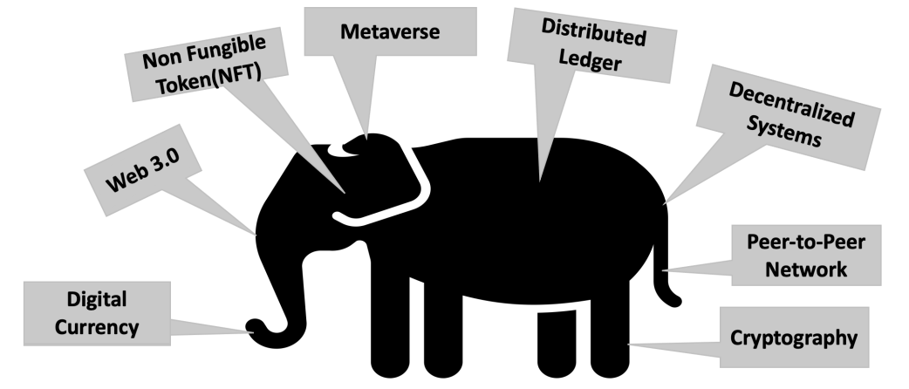
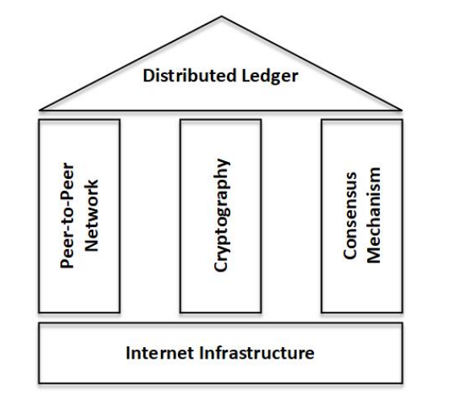

# Blockchain and Cryptocurrency

Satoshi Nakamoto, a mysterious and anonymous entity, published a whitepaper
on October 31, 2008, called **Bitcoin: A Peer-to-Peer Electronic Cash System**, which is considered the
origin of Bitcoin and all cryptocurrencies. Satoshi proposed a completely decentralized approach for
Peer-to-Peer (P2P) payment without central banks or intermediaries.

**Mining**: Mining is the process by which network nodes in blockchain systems add new blocks
to the blockchain and get rewarded with crypto-incentives.

